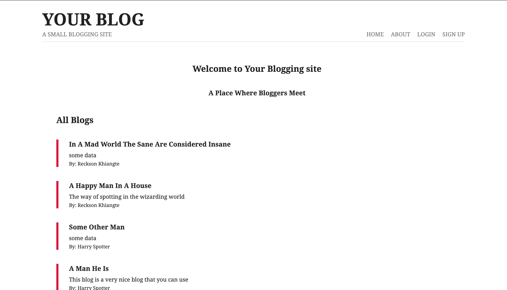

# Node.js Blog

A small blog built using Node.js and the EJS view engine. This project was created as an exercise to learn Node.js and various backend technologies such as JWT for authentication and authorization.

### Screenshot

## Things I learnt

- How to create an Express server using Node.js
- Server Side Rendering(SSR) using EJS
- Creating a CRUD App using Mongoose and MongoDB
- Creating Schemas and Models in Mongoose
- Using third party Middlewares
- Impementing user authentication and authorization with JWT
- Using MVC design pattern
- Using cookies to send a token to the browser
- Using bcrypt to encrypt data i.e. passwords
- Using a validator to perform server side validation of user data

## Resources

- [EJS](https://ejs.co/)
- [Express](https://expressjs.com/)
- [JWT](https://jwt.io/introduction)
- [Mongoose](https://mongoosejs.com/docs/index.html)
- [Code Example](https://github.com/iamshaunjp/node-express-jwt-auth/tree/lesson-18)

### Node Libraries I used worth saving

- [Validator](https://www.npmjs.com/package/validator)

### Articles I found useful

- [https://vegibit.com/mongoose-relationships-tutorial/](https://vegibit.com/mongoose-relationships-tutorial/)

## Possible Extension Feature

- [ ] Add categories and filter for content
- [x] Add author and date to blog / Automatically attach author when creating new blog
- [ ] Improve style of blog
- [x] Add login and users
- [x] Manage login/logut state (Add login/logout, Sign Up button to Nav bar) 
- [x] If logged out cannot access delete/edit and create blog (Protected Routes and conditionals)
- [ ] Handle errors and setup client side validation
- [x] Make Users able to edit only their blogs
- [x] Add my blogs page where users can see a list of their blogs
- [x] Add blogs feed page where users can see all the blogs
- [ ] Add an unique route for each user so they can share their blog
- [ ] Add OAuth in the login and signup
- [ ] Add search functionality
- [ ] Add comments and likes for blogs
- [ ] Add text formatting for blog content
- [ ] Add image to blog
- [ ] Add infinite Scroll